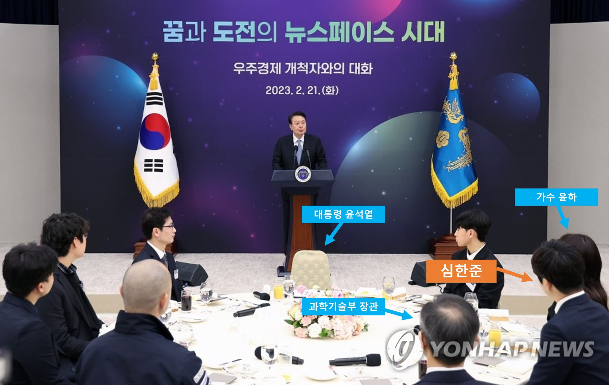

## [뉴스페이스 시대 우주경제 개척자와의 대화](https://www.president.go.kr/newsroom/photo_news/Hab1bRJk)
- Title: A conversation with a space economy pioneer in the Newspace era (Invited Event)
- Source: 대한민국 대통령실 (Office of the President of the Republic of Korea)
- Language: Korean
- Invited to an event hosted by the Office of the President of the Republic of Korea

 

 

# Releted Media Report (Selected)

 

## 1) [대한민국 우주경제 시대, 우주항공청을 최고의 연구개발 플랫폼으로! [뉴스페이스 시대 우주경제 개척자와의 대화]](https://www.youtube.com/watch?v=C-zUniIu5pw)
- Title: A conversation with a space economy pioneer in the Newspace era
- Source: 대한민국 대통령실 (Office of the President of the Republic of Korea)
- Language: Korean

**Video**:
    
 

 

## 2) [이과인들의 간담회에 윤하의 등장이라…대통령실이 그를 초대한 이유는 무엇이었을까?](https://www.youtube.com/watch?v=V_hGZgiFsls)
- Title: Yoon Ha appeared at a meeting of science students… Why did the Blue House invite him?
- Source: 비디오머그
- Language: Korean

**Video**:
    
 

## 3) [‘우주개척자’ 만난 尹 “우주산업 국가가 관리하고 키워나가갈것”](https://www.donga.com/news/Politics/article/all/20230221/118011142/1)
- Title: President Yoon met with ‘space pioneers’, “The space industry will be managed and developed by the state”
- Source: 동아일보
- Language: Korean

 
