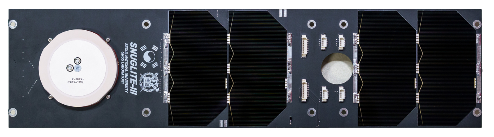

### Overview
1) Fit to Standard 3U Size CubeSats
2) Two series-connected AzurSpace 3G30A solar cells
3) Sun sensor and temperature sensor on a single PCB 1.2mm thick (Gomspace Interstage GSSB is compatible)

 

In the SNUGLITE-III project, one of the main focus (to reduce budget) was on the fabrication of the solar panels for the CubeSat. I was solely responsible for the entire process, from PCB design to fabrication. Using Gomspace products as a benchmark, I ensured that all the solar panels were compatible and could integrate seamlessly with the system. Additionally, I verified the functionality of the panels through vacuum testing and solar simulator experiments, confirming that they performed as expected.

 