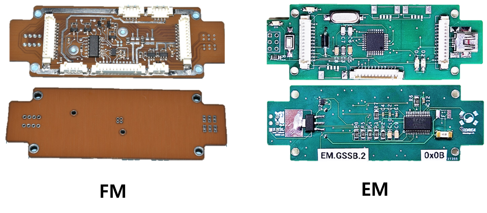
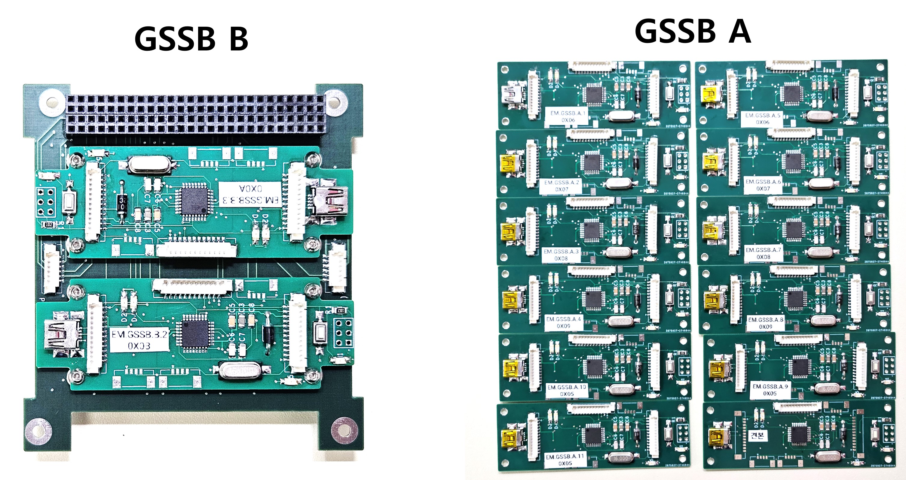

### Overview
1) Fit to Standard 3U Size CubeSats
2) Two series-connected AzurSpace 3G30A solar cells
3) Sun sensor and temperature sensor on a single PCB 1.2mm thick (Gomspace Interstage GSSB is compatible)

 

For this project, an Engineering Model (EM) of the Interstage GSSB was developed. This design replicates all the functions of the Gomspace Interstage GSSB. Since our team only ordered a limited number of Flight Models (FM), an EM was necessary for testing purposes, as additional FM units were too costly. To facilitate rapid development, I designed the EM to be Arduino-compatible and implemented all protocols to match those of the Gomspace FM. Since this panel does not need to operate in space, it is ideal for flight software testing.

 

 
 