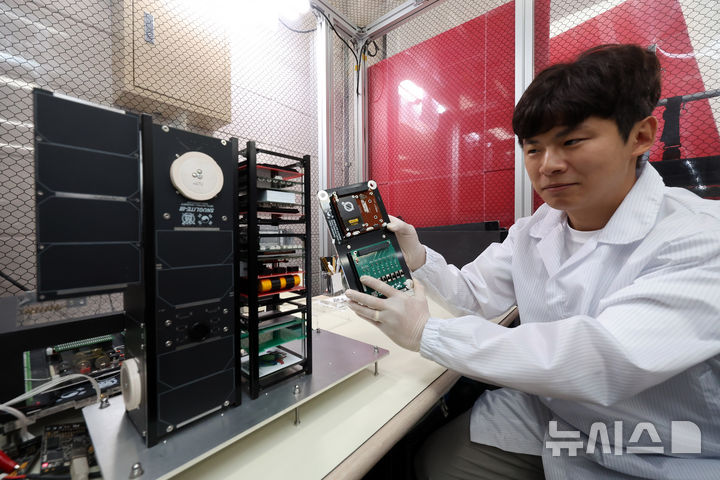
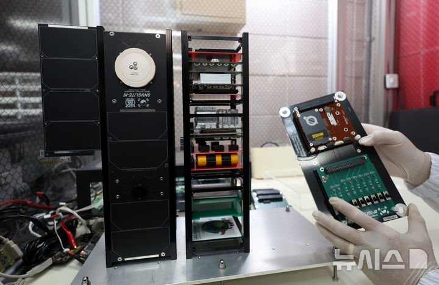
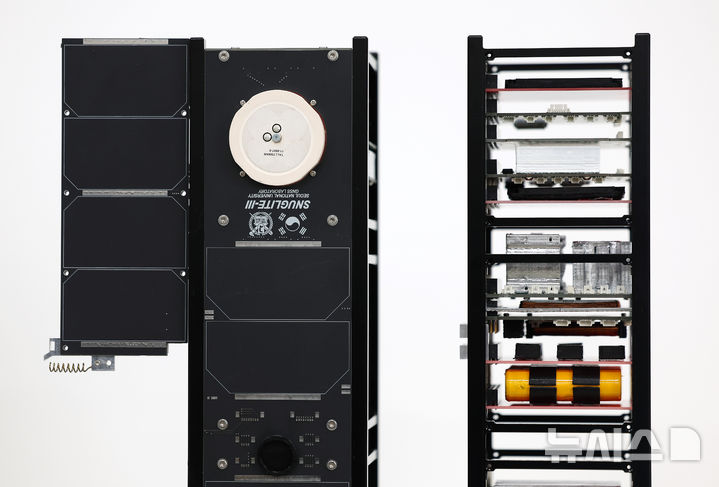
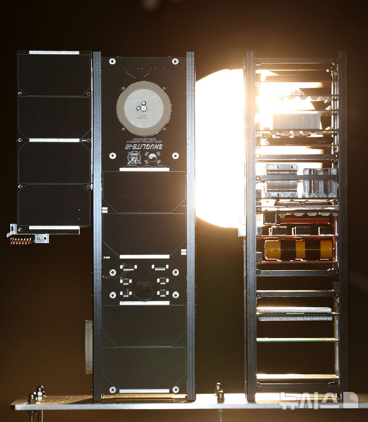

## 1) [큐브위성 스누그라이트-3 소개하는 심한준 연구원](https://www.newsis.com/view/NISI20240926_0020534523)
- Title: Researcher Hanjoon Shim introduces SNUGLITE-III CubeSat
- Source: Newsis
- Language: Korean  
  (featured figure)

 

## 2) [큐브위성 스누그라이트-3 소개하는 심한준 연구원](https://www.newsis.com/view/NISI20240926_0020534521)
- Title: Researcher Hanjoon Shim introduces SNUGLITE-III CubeSat
- Source: Newsis
- Language: Korean
 

 

## 3) [누리호 4호기에 탑재될 큐브위성 스누그라이트-3](https://www.newsis.com/view/NISI20240926_0020534522)
- Title: SNUGLITE-III CubeSat to be loaded on Nuriho 4th launch
- Source: Newsis
- Language: Korean
 

 

## 4) [큐브위성 스누그라이트-3](https://www.newsis.com/view/NISI20240926_0020534527)
- Title: SNUGLITE-III CubeSat
- Source: Newsis
- Language: Korean
 

## 5) [누리호 4호기와 함께 우주로 향할 '스누그라이트-3'](https://www.newsis.com/view/NISI20240926_0020534528)
- Title: 'SNUGLITE-III' to Head to Space with Nuri 4th
- Source: Newsis
- Language: Korean
 

 

## 6) ['스누그라이트-3, 우주로 향하다'](https://www.newsis.com/view/NISI20240926_0020534524)
- Title: SNUGLITE-III, Heading to Space
- Source: Newsis
- Language: Korean
 

 
 

# Releted Media Report

 

## 7) [서울대, 세계최초 기술 '저비용-고효율 위성 SNUGLITE-Ⅲ' 우주로](https://news.mt.co.kr/mtview.php?no=2024092618395630853)

- Title: SNU, The world's first technology 'low-cost, high-efficiency satellite SNUGLITE-II' into space
- Source: 머니투데이
- Language: Korean

 

## 8) [서울대, 4차 누리호에 ‘3차원 대기 관측’ 큐브위성 태운다](https://www.segye.com/newsView/20240926521515?OutUrl=naver)
- Title: SNU to Launch CubeSat for ‘3D Atmospheric Observation’ on 4th Nuri
- Source: 세계일보
- Language: Korean
- Tag: SNUGLITE-III

 

## 9) [4차 발사 누리호에 '3차원 대기 관측' 쌍둥이 미니위성 태운다](https://www.edaily.co.kr/News/Read?newsId=03906486639024056&mediaCodeNo=257&OutLnkChk=Y)
- Title: 4th Launch Nuri to Carry Twin CubeSats for '3D Atmosphere Observation'
- Source: 연합뉴스
- Language: Korean

 

## 10) [서울대, 3차원 대기 관측용 쌍둥이 위성 개발…“세계 최초 기술 사용”](https://www.edaily.co.kr/News/Read?newsId=03906486639024056&mediaCodeNo=257&OutLnkChk=Y)
- Title: SNU Develops Twin CubeSats for 3D Atmosphere Observation… “World’s First Technology Used”
- Source: 이데일리
- Language: Korean
