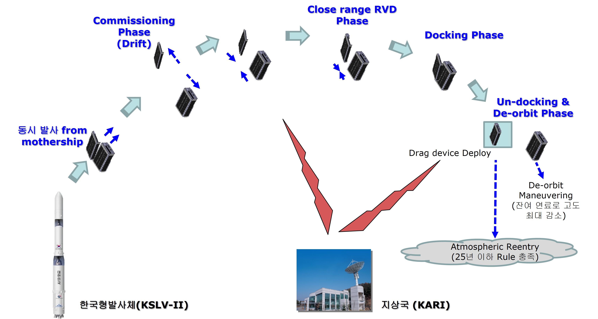
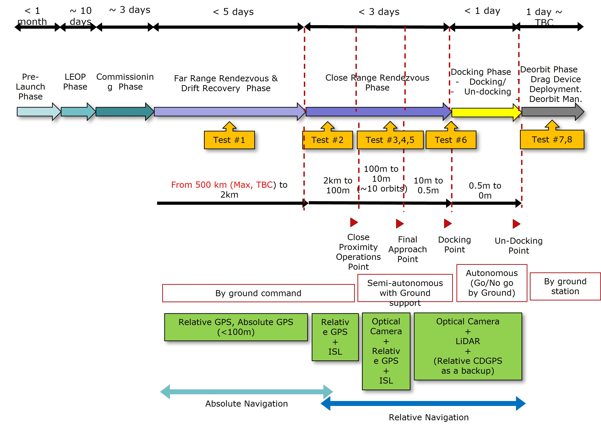
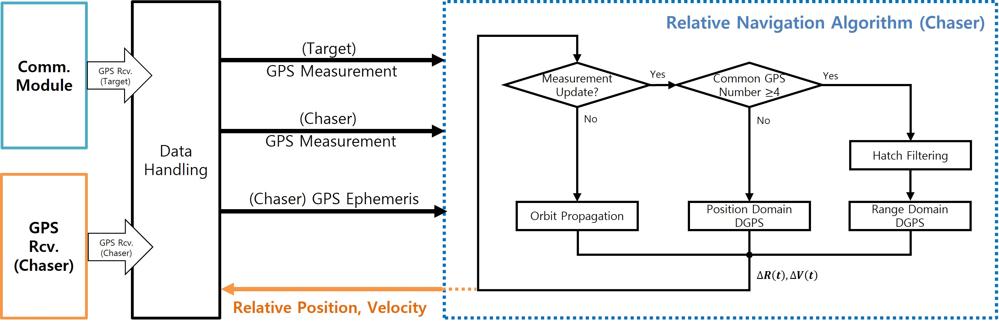
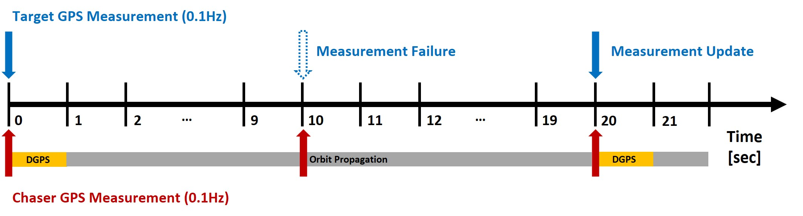
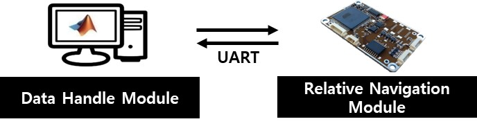

<!-------------------------------------------------------------------------------------->

### KARI Rendezvous&Docking SATellite (KARDSAT) CubeSat GPS Relative Navigation Project

The KARDSAT CubeSat project consists of a 3U (Target) and a 6U (Chaser) CubeSat, aimed at developing and validating core technologies for rendezvous, docking, and proximity operations through a nano-satellite developed by the Korea Aerospace Research Institute (KARI). The primary objectives of this mission include the development of technologies for rendezvous and docking of nano-satellites, state estimation of space objects, recognition of target objects using deep learning techniques, the development of atmospheric drag augmentation devices for satellite disposal, a compact docking mechanism for microsatellites, precise relative navigation technology (electro-optcal and GPS based), and inter-satellite link technologies for close-proximity (km-level) satellite operations. The GPS-based relative navigation technology, which is essential for precise relative navigation, was entrusted to the GNSS Laboratory at Seoul National University. This CubeSat was intended to be launched on the Korean launch vehicle (KSLV-II, Nuri) in 2022; however, the satellite was **not launched**, and **only the technology development** was carried out. A national report on the relevant technology is available [here](https://scienceon.kisti.re.kr/srch/selectPORSrchReport.do?cn=TRKO201900001630#;).

This project was conducted from 2019 to 2020. As the first doctoral student involved in this project, I served as the **Project Manager**, handling all aspects from documentation to **practical implementation**, with guidance from one postdoctoral researcher. I was responsible for the following tasks: *designing a decimeter-level GPS relative navigation system for KARDSAT, conducting MATLAB SILS simulations, and performing C-based PILS to deliver the flight code*. [See related publication](/publication/ij_202301/).

- **Project Management**
     - Managed all tasks related to project oversight, including proposal writing, presentation preparation, and report generation.
-	**Developed a real-time single-frequency GPS-based relative navigation system**
     - Designed a Deci-meter level spacecraft DGPS navigation system (GPS L1 only).
     - Conducted SILS (Matlab) and PILS (Linux-gcc, C)

 

<!-------------------------------------------------------------------------------------->

## **Index**

**[1. KARDSAT CubeSat](#1-kardsat-cubesat)** 
&nbsp;&nbsp;&nbsp;[1.1. System Configuration](#11-system-configuration)  
&nbsp;&nbsp;&nbsp;[1.2. Operation Scenario](#12-operation-scenario)  
**[2. GPS Relative Navigation System](#2-gps-relative-navigation-system)** 
&nbsp;&nbsp;&nbsp;[2.1. Overall Block Diagram](#21-overall-block-diagram)  
&nbsp;&nbsp;&nbsp;[2.2. Software-In-the-Loop Simulation (SILS)](#22-software-in-the-loop-simulation-sils)  
&nbsp;&nbsp;&nbsp;[2.3. Processor-In-the-Loop Simulation (PILS)](#23-processor-in-the-loop-simulation-pils)  

 

<!-------------------------------------------------------------------------------------->

## **1. KARDSAT CubeSat**

<!-------------------------------------------------------------------------------------->

### 1.1. System Configuration

**Table. System Configuration of the KARDSAT CubeSat**  
| System     | Description           |
|------------|-----------------------|
| Mass       | Chaser 6U: 12 kg      |
|            | Target 3U: 5 kg       |
| Dimension  | 200x100x340.5 mm (6U) |
|            | 100x100x340.5 mm (3U) |
| Orbit      | 700 km, SSO           |
| Link       | UHF (Uplink, Downlink) |
|            | S-Band (Uplink, Downlink) |
| Actuators  | 6-DOF Thruster, Reaction Wheel, Magnetorquer |
| Reference  | [Report on National R&D](https://scienceon.kisti.re.kr/srch/selectPORSrchReport.do?cn=TRKO201900001630#;)  |

<!-------------------------------------------------------------------------------------->

### 1.2. Operation Scenario

The Chaser is equipped with thrusters for orbital control, visual sensors for shape recognition and attitude estimation of the Target, and a docking device for demonstration purposes. The Target features an LED marker to facilitate the Chaser's attitude estimation and a drag device for deorbiting after mission completion. Upon deployment from the P-POD, the two satellites will gradually drift apart due to orbital perturbations, estimated to reach a distance of approximately 500 km within three days until they establish communication for orbital control. After the first contact, the Chaser will perform orbital maneuvers to approach the Target, controlled by commands from the ground station until they are about 2 km apart. Within this range, relative navigation and control will bring them closer to within approximately 10 meters. The Target will transmit its orbital information to the Chaser, which will estimate the relative distance and execute the necessary maneuvers. Once within 10 meters, the Chaser will use its visual sensors for shape recognition and state estimation before initiating docking control. After successful docking, the Chaser will immediately detach and use its remaining fuel to lower its altitude, while the Target will deploy its drag device.

**This research project** aims to develop a **relative GPS system for KARDSAT**, utilized during Tests #1 to #5 as shown in the diagrams, with a requirement to *achieve sub-meter real-time GPS relative navigation and deliver flight code as the project's goal*.

 
 

<!-------------------------------------------------------------------------------------->

## **2. GPS Relative Navigation System**

### 2.1. Overall Block Diagram

### 2.2. Software-In-the-Loop Simulation (SILS)

 - SILS based on MATLAB (Module seperated) 

**Video**:
    
 
 

<!-------------------------------------------------------------------------------------->

### 2.3. Processor-In-the-Loop Simulation (PILS)

 - Implamentation based on C (linux-gcc, FreeRTOS, Gomspace A3200 OBC). For more details, refer to the paper on HILS verification results [here](/publication/ij_202302/).

 **Video**:
    

 

 For more details, refer to the paper on GPS-based relative navigation [here](/publication/ij_202301/).

 

<!-------------------------------------------------------------------------------------->

 # For more information, refer to the related publications below. :)