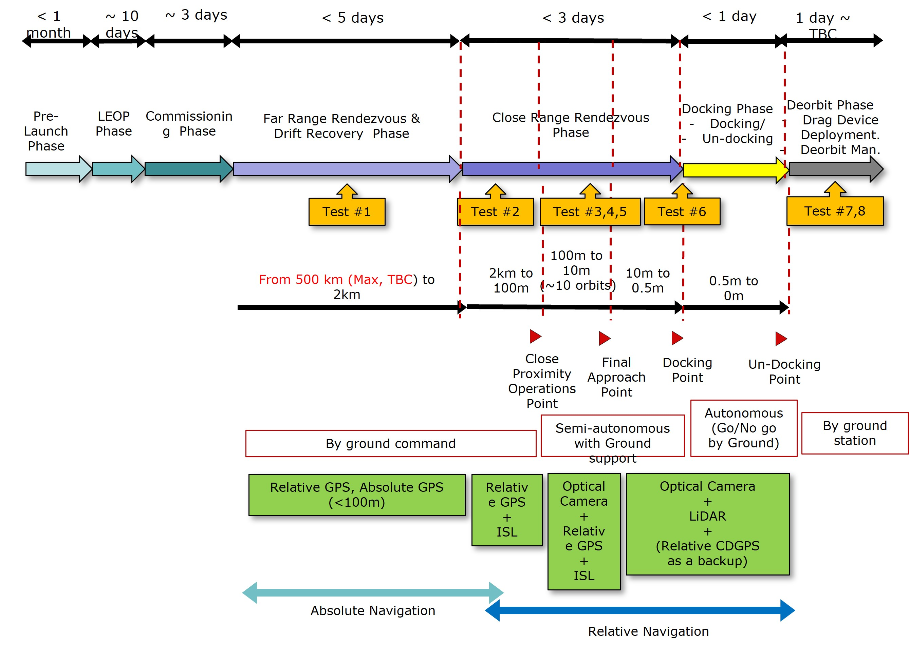

<!-------------------------------------------------------------------------------------->

### KARI Rendezvous&Docking SATellite (KARDSAT) CubeSat GPS Relative Navigation Project

The KARDSAT CubeSat project consists of a 3U (Target) and a 6U (Chaser) CubeSat, aimed at developing and validating core technologies for rendezvous, docking, and proximity operations through a nano-satellite developed by the Korea Aerospace Research Institute (KARI). The primary objectives of this mission include the development of technologies for rendezvous and docking of nano-satellites, state estimation of space objects, recognition of target objects using deep learning techniques, the development of atmospheric drag augmentation devices for satellite disposal, a compact docking mechanism for microsatellites, precise relative navigation technology (electro-optcal and GPS based), and inter-satellite link technologies for close-proximity (km-level) satellite operations. The GPS-based relative navigation technology, which is essential for precise relative navigation, was entrusted to the GNSS Laboratory at Seoul National University. This CubeSat was intended to be launched on the Korean launch vehicle (KSLV-II, Nuri) in 2022; however, the satellite was not launched, and only the technology development was carried out. A national report on the relevant technology is available [here](https://scienceon.kisti.re.kr/srch/selectPORSrchReport.do?cn=TRKO201900001630#;).

This project was conducted from 2019 to 2020. As the first doctoral student involved in this project, I served as the Project Manager, handling all aspects from documentation to practical implementation, with guidance from one postdoctoral researcher. I was responsible for the following tasks: designing a decimeter-level GPS relative navigation system for KARDSAT, conducting MATLAB SILS simulations, and performing C-based PILS to deliver the flight code. [See related publication](/publication/ij_202301/).

- **Project Management**
     - Managed all tasks related to project oversight, including proposal writing, presentation preparation, and report generation.
-	**Developed a real-time single-frequency GPS-based relative navigation system**
     - Designed a Deci-meter level spacecraft DGPS navigation system (GPS L1 only).
     - Conducted SILS (Matlab) and PILS (Linux-gcc, C)

 

<!-------------------------------------------------------------------------------------->

## **Index**

**[1. KARDSAT CubeSat](#1-kardsat-cubesat)** 
&nbsp;&nbsp;&nbsp;[1.1. System Configuration](#11-system-configuration)  
&nbsp;&nbsp;&nbsp;[1.2. Operation Scenario](#12-operation-scenario)  
**[2. Attitude Determination and Control System (ADCS)](#2-attitude-determination-and-control-system-adcs)** 
&nbsp;&nbsp;&nbsp;[2.1. Software-In-the-Loop Simulation (SILS)](#21-software-in-the-loop-simulation-sils)  
&nbsp;&nbsp;&nbsp;[2.2. Hardware-In-the-Loop Simulation (HILS)](#22-hardware-in-the-loop-simulation-hils)  
**[3. Operation Results](#3-operation-results)** 
&nbsp;&nbsp;&nbsp;[3.1. CubeSat GPS L1/L2C Receiver](#31-cubesat-gps-l1l2c-receiver)  
&nbsp;&nbsp;&nbsp;[3.2. ADCS](#32-adcs)  

 

<!-------------------------------------------------------------------------------------->

## **1. KARDSAT CubeSat**

<!-------------------------------------------------------------------------------------->

### 1.1. System Configuration

**Table. System Configuration of the SNUGLITE-I CubeSat**  
*DQPSK: differential quadrature phase-shift keying; GMSK: Gaussian minimum shift keying;*
*UHF: ultra-high frequency*
| System     | Description         |
|------------|---------------------|
| Mass       | 1.9 kg              | 
| Dimension  | 100x100x227 mm (2U) |
| Orbit      | 575 km, SSO         |
| Uplink     | UHF (437.275MHz), AX.25, GMSK 9.6 kbps (telecommand) |
| Downink    | UHF (437.275MHz), AX.25, GMSK 9.6 kbps (telemetry)   |
|            | S-Band (2405MHz), DQPSK, 1 Mbps (mission data)       |
| Payloads   | SNU L1/L2C GPS Receiver x2 (1st gen)                 |
|            | 3-axis fluxgate magnetometer w/ deployable boom      |
| Actuators  | PCB-based magnetorquer x3                            |
| Reference  | NORAD 43784, COSIPAR 2018-099AC, [SatNOGS](https://db.satnogs.org/satellite/SVDW-0245-3507-2344-8404), [Gunter's Space](https://space.skyrocket.de/doc_sdat/snuglite.htm) |

<!-------------------------------------------------------------------------------------->

### 1.2. Operation Scenario

 The mission consists of three modes: Detumbling mode, Mission mode (GPS data collection), and Mission mode (Magnetometer boom data collection). Upon ejection from the P-POD, the satellite enters the initial mode, damping angular velocity. Depending on the deployment of the boom, the Mission Mode varies. The ADCS aims to control the satellite's nadir-pointing to collect data.

 
 

<!-------------------------------------------------------------------------------------->

## **2. Attitude Determination and Control System (ADCS)**

Related to my Master’s thesis [here](/publication/thesis_master/).

### 2.1. Software-In-the-Loop Simulation (SILS)

#### Algorithm design: Developed based on work inherited from previous graduates
 - SILS based on MATLAB 
 - Attitude determination: Extended Kalman filter (combined with coarse sun sensor, magnetometer, and gyroscope)
 - Attitude control: LQR controller (magnetorquer only)

**Video**:
    
 
 

<!-------------------------------------------------------------------------------------->

### 2.2. Hardware-In-the-Loop Simulation (HILS)

#### Helmholtz cage design and assembly
 - 3-axis magnetic cotrol based classical control (PI controller, 50Hz)
 - Codevision based on Atemega 128, C language
 

**Video**:
    

 

#### Single-axis HILS verification using Helmholtz cage
 - ADCS implamentation based on C (linux-gcc, FreeRTOS, Gomspace A3200 OBC). For more details, refer to the paper on HILS verification results [here](/publication/ij_202302/).

 **Video (50x Fast)**:
    

 
 

<!-------------------------------------------------------------------------------------->

## **3. Operation Results**

### 3.1. CubeSat GPS L1/L2C Receiver

Due to a failure in the communication module's uplink, the primary mission of the SNUGLITE-I CubeSat could not be fully verified, resulting in a partial success. However, the GPS receiver development, the core mission of SNUGLITE-I, was successfully completed. The beacon transmits navigation information every 10 seconds, and this data has been used for orbit determination, successfully validating the GPS receiver.

<!-------------------------------------------------------------------------------------->

### 3.2. ADCS 

After launch and ejection from P-POD, SNUGLITE-I successfully damped its angular velocity and entered standby mode. The satellite has been performing nadir-pointing control in standby mode. Using attitude data received via the beacon, the ADCS was indirectly evaluated, demonstrating approximately 15° accuracy in attitude determination and control, achieved solely using magnetorquers without reaction wheels.

 

 For more details, refer to the paper on in-orbit results [here](/publication/ij_202001/).

 

<!-------------------------------------------------------------------------------------->

 # For more information, refer to the related publications below. :)