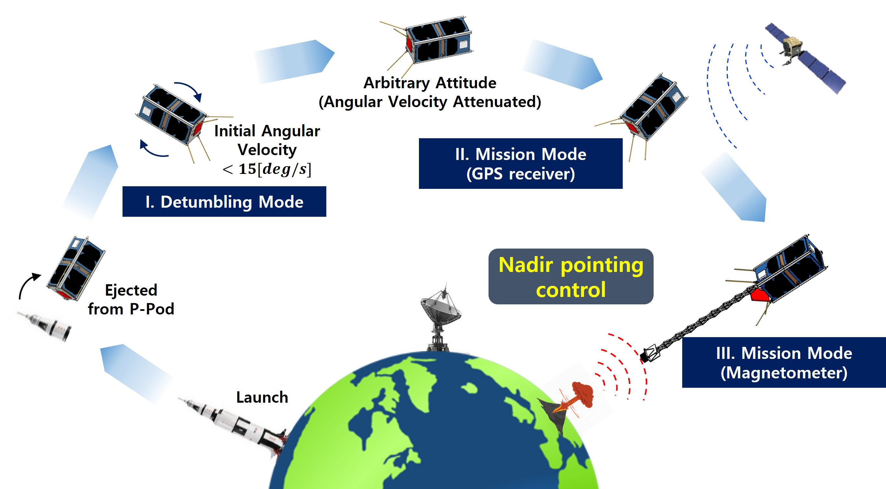
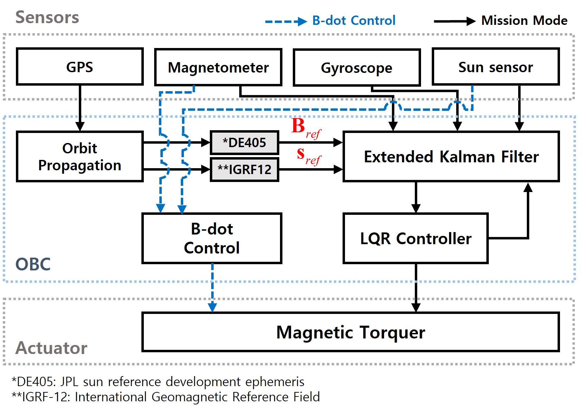
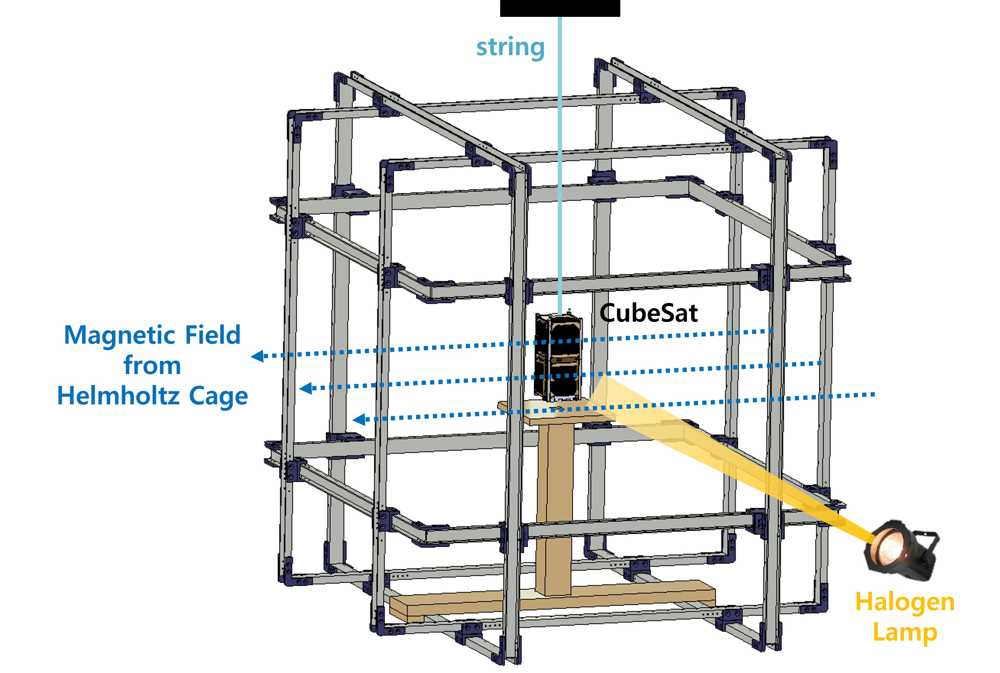

<!-------------------------------------------------------------------------------------->

### Seoul National University GNSS Laboratory Satellite (SNUGLITE)-I Project

The SNUGLITE-I CubeSat was selected as a finalist in the "2015 CubeSat Competition" organized by the Korea Aerospace Research Institute, with a total funding of 275 million KRW. The main mission was to develop a dual-frequency L1/L2C GPS receiver for CubeSats and use GPS Radio Occultation (RO) to model the ionosphere. Launched in December 2018, SNUGLITE-I is still broadcasting beacons, but due to a failure in the communication module’s receiver, uplink functionality is currently unavailable. For more details, refer to the paper on in-orbit results [here](/publication/ij_202001/).

This project was conducted from 2015 to 2019, and I joined the SNUGLITE team in 2017 as a master’s student. As an **Attitude Determination and Control System (ADCS)** engineer, I was responsible for the following tasks. These were based on knowledge passed down from previous graduate students, and I implemented the algorithms developed in MATLAB into C and conducted the integration and testing. [See related publication](/publication/ij_202302/).

-	**Developed ADCS Algorithm**
     - EKF-based attitde determination system (Sun+Gyro+Mag)
     - LQR-based attitude control system (magnetometer only)
     - Conducted SILS (Matlab), PILS (Linux-gcc, C), and HILS 
-	**Developed a HILS platform for ADCS** [[Master's Thesis]](/publication/thesis_master/)
     - Single-axis ADCS HILS Verification
     - Design and fabrication of the Helmholtz cage

 

<!-------------------------------------------------------------------------------------->

## **Index**

**[1. SNUGLITE-I CubeSat](#1-snuglite-i-cubesat)** 
&nbsp;&nbsp;&nbsp;[1.1. System Configuration](#11-system-configuration)  
&nbsp;&nbsp;&nbsp;[1.2. Operation Scenario](#12-operation-scenario)  
&nbsp;&nbsp;&nbsp;[1.3. Launch](#13-launch)  
**[2. Attitude Determination and Control System (ADCS)](#2-attitude-determination-and-control-system-adcs)**   
&nbsp;&nbsp;&nbsp;[2.1. Software-In-the-Loop Simulation (SILS)](#21-software-in-the-loop-simulation-sils)  
&nbsp;&nbsp;&nbsp;[2.2. Hardware-In-the-Loop Simulation (HILS)](#22-hardware-in-the-loop-simulation-hils)  
**[3. Operation Results](#3-operation-results)** 
&nbsp;&nbsp;&nbsp;[3.1. CubeSat GPS L1/L2C Receiver](#31-cubesat-gps-l1l2c-receiver)  
&nbsp;&nbsp;&nbsp;[3.2. ADCS](#32-adcs)  

 

<!-------------------------------------------------------------------------------------->

## **1. SNUGLITE-I CubeSat**

<!-------------------------------------------------------------------------------------->

### 1.1. System Configuration

**Table. System Configuration of the SNUGLITE-I CubeSat**  
*DQPSK: differential quadrature phase-shift keying; GMSK: Gaussian minimum shift keying;*
*UHF: ultra-high frequency*
| System     | Description         |
|------------|---------------------|
| Mass       | 1.9 kg              | 
| Dimension  | 100x100x227 mm (2U) |
| Orbit      | 575 km, SSO         |
| Uplink     | UHF (437.275MHz), AX.25, GMSK 9.6 kbps (telecommand) |
| Downink    | UHF (437.275MHz), AX.25, GMSK 9.6 kbps (telemetry)   |
|            | S-Band (2405MHz), DQPSK, 1 Mbps (mission data)       |
| Payloads   | SNU L1/L2C GPS Receiver x2 (1st gen)                 |
|            | 3-axis fluxgate magnetometer w/ deployable boom      |
| Actuators  | PCB-based magnetorquer x3                            |
| Reference  | NORAD 43784, COSIPAR 2018-099AC, [SatNOGS](https://db.satnogs.org/satellite/SVDW-0245-3507-2344-8404), [Gunter's Space](https://space.skyrocket.de/doc_sdat/snuglite.htm) |

<!-------------------------------------------------------------------------------------->

### 1.2. Operation Scenario

 The mission consists of three modes: Detumbling mode, Mission mode (GPS data collection), and Mission mode (Magnetometer boom data collection). Upon ejection from the P-POD, the satellite enters the initial mode, damping angular velocity. Depending on the deployment of the boom, the Mission Mode varies. The ADCS aims to control the satellite's nadir-pointing to collect data.

<!-------------------------------------------------------------------------------------->

### 1.3. Launch

On December 3, 2018, at 18:32:00+00:00 (UTC), SNUGLITE-I was launched as part of Spaceflight Industries' SSO-A multi-satellite mission on a Falcon-9 v1.2 (Block 5) rocket.

**Video**:
    

 
 

<!-------------------------------------------------------------------------------------->

## **2. Attitude Determination and Control System (ADCS)**

Related to my Master’s thesis [here](/publication/thesis_master/).

### 2.1. Software-In-the-Loop Simulation (SILS)

#### Algorithm design: Developed based on work inherited from previous graduates
 - SILS based on MATLAB 
 - Attitude determination: Extended Kalman filter (combined with coarse sun sensor, magnetometer, and gyroscope)
 - Attitude control: LQR controller (magnetorquer only)

**Video**:
    
 
 

<!-------------------------------------------------------------------------------------->

### 2.2. Hardware-In-the-Loop Simulation (HILS)

#### Helmholtz cage design and assembly
 - 3-axis magnetic cotrol based classical control (PI controller, 50Hz)
 - Codevision based on Atemega 128, C language
 

**Video**:
    

 

#### Single-axis HILS verification using Helmholtz cage
 - ADCS implamentation based on C (linux-gcc, FreeRTOS, Gomspace A3200 OBC). For more details, refer to the paper on HILS verification results [here](/publication/ij_202302/).

 **Video (50x Fast)**:
    

 
 

<!-------------------------------------------------------------------------------------->

## **3. Operation Results**

### 3.1. CubeSat GPS L1/L2C Receiver

Due to a failure in the communication module's uplink, the primary mission of the SNUGLITE-I CubeSat could not be fully verified, resulting in a partial success. However, the GPS receiver development, the core mission of SNUGLITE-I, was successfully completed. The beacon transmits navigation information every 10 seconds, and this data has been used for orbit determination, successfully validating the GPS receiver.

<!-------------------------------------------------------------------------------------->

### 3.2. ADCS 

After launch and ejection from P-POD, SNUGLITE-I successfully damped its angular velocity and entered standby mode. The satellite has been performing nadir-pointing control in standby mode. Using attitude data received via the beacon, the ADCS was indirectly evaluated, demonstrating approximately 15° accuracy in attitude determination and control, achieved solely using magnetorquers without reaction wheels.

 

 For more details, refer to the paper on in-orbit results [here](/publication/ij_202001/).

 

<!-------------------------------------------------------------------------------------->

 # For more information, refer to the related publications below. :)