<!-------------------------------------------------------------------------------------->

### Seoul National University GNSS Laboratory Satellite (SNUGLITE)-II Project

The SNUGLITE-II CubeSat was selected as a finalist in the "2019 CubeSat Competition" organized by the Korea Aerospace Research Institute, receiving a total funding of 475 million KRW. The primary mission was to develop the second generation of the dual-frequency L1/L2C GPS receiver, which was originally developed in the [SNUGLITE-I CubeSat project](/project/snuglite-i/). The project aimed to improve the quality of millimeter-level carrier phase measurements and to miniaturize the receiver. Using this advanced GPS receiver, the mission included conducting 3D Earth atmospheric observations through GPS Radio Occultation (RO). Technological objectives included the world's first stand-alone GPS-based attitude determination system implemented in a 3U CubeSat, as well as the development of an indigenous reaction wheel-based attitude control system. 
SNUGLITE-II was a standard 3U CubeSat, launched aboard South Korea's first indigenous orbital launch vehicle, the Nuri (KSLV-II), as part of the performance verification satellite payload in a P-POD, on June 21, 2022. After *approximately 11 days of nominal operation in commissioning mode and receiving partial mission data via UHF bi-directional communication, a sudden loss of communication occurred*, leading to the official end of the mission. For more details, refer to the paper on in-orbit results (in Korean) [here](/publication/ij_202001/).

This project ran from 2019 to 2022, and I served as **the team leader** of the SNUGLITE team, overseeing every stage from preliminary design during the 2019 CubeSat Competition to the satellite's launch. In addition to my role as **Project Manager**, I took on the responsibilities of **Attitude Control System (ACS)** engineer, leading the development of the **flight software**, **hardware design**, and the **assembly, integration, and test** processes. Through this CubeSat project, I gained hands-on experience in all stages of satellite development.

- **Project Manager**
     - Led the SNUGLITE team with proactive leadership throughout the project
     - Organized and led all milestone meetings, including system design, preliminary design, detailed design, test readiness review, and shipment review
     - Managed budget, schedules, reports, and system design processes
-	**Developed Attitute Control System (ACS) Algorithm**
     - Developed a quaternion-based attitude control system
     - Implemented an LQR-based attitude control system using reaction wheels and magnetic torquers
     - Conducted SILS (Matlab), PILS (Linux-gcc, C), and HILS
-	**Developed Flight Software**
     - Developed software based on a real-time OS (FreeRTOS, Gomspace A3200 OBC)
     - Round-robin-based scheduling (ADCS) program
     - Priority-based scheduling (CDH) program
- **Assembly, Integration, and Test (AIT)**
     - Performed all stages of satellite assembly
     - Led the integration of subsystems and completed software integration (including sensor calibration)
     - Conducted far-field tests, vibration tests for launch, and space environment testing

 

<!-------------------------------------------------------------------------------------->

## **Index**

**[1. SNUGLITE-II CubeSat](#1-snuglite-ii-cubesat)** 
&nbsp;&nbsp;&nbsp;[1.1. SNUGLITE Team (2019)](#11-snuglite-team-2019)  
&nbsp;&nbsp;&nbsp;[1.2. System Configuration](#12-system-configuration)  
&nbsp;&nbsp;&nbsp;[1.3. Operation Scenario](#13-operation-scenario)  
**[2. Attitude Control System (ACS)](#2-attitude-control-system-acs)** 
&nbsp;&nbsp;&nbsp;[2.1. Overall Block Diagram](#21-software-in-the-loop-simulation-sils)  
&nbsp;&nbsp;&nbsp;[2.2. Software-In-the-Loop Simulation (SILS)](#21-software-in-the-loop-simulation-sils)  
&nbsp;&nbsp;&nbsp;[2.3. Hardware-In-the-Loop Simulation (HILS)](#22-hardware-in-the-loop-simulation-hils)  
**[3. Assembly, Integration, and Test (AIT)](#1-snuglite-i-cubesat)** 
&nbsp;&nbsp;&nbsp;[3.1. Hardware Design (PCB)](#21-software-in-the-loop-simulation-sils)  
&nbsp;&nbsp;&nbsp;[3.2. Assembly and Integration](#21-software-in-the-loop-simulation-sils)  
&nbsp;&nbsp;&nbsp;[3.3. Environment Test](#21-software-in-the-loop-simulation-sils)  
**[4. Operation Results](#4-operation-results)** 
&nbsp;&nbsp;&nbsp;[4.1. Launch and Initial Operation](#41-launch-and-initial-operation)  
&nbsp;&nbsp;&nbsp;[4.2. CubeSat GPS L1/L2C Receiver](#42-cubesat-gps-l1l2c-receiver)  
&nbsp;&nbsp;&nbsp;[4.3. ACS](#43-acs)  

 

<!-------------------------------------------------------------------------------------->

## **1. SNUGLITE-II CubeSat**

<!-------------------------------------------------------------------------------------->

### 1.1. SNUGLITE Team (2019)

**Table. SNUGLITE Team Member and Role (2019)**

1 PM: Project Manager, 
2 SYS: Satellite System,
3 FSW: Flight Software,
4 ACS: Attitude Control System,
5 AIT: Assembly, Integration, and Test
6 EPS: Electrical Power System,
7 COM: Comuunication Sytstem,
8 GND: Ground Station,
9 STR: Structure System, 
10 THR: Thermal System,
11 PAY1: Payload1 (GPS Receiver),
12 PAY2: Payload2 (GPS Attitude Determination),
13 PAY3: Payload3 (Camera)
14 EOP: End of Project

| Name                                      | Role                                          | Participation Period |
|-------------------------------------------|-----------------------------------------------|-----------|
| [Changdon Kee](/author/changdon-kee/)     | Supervisor                                    | -         |
| [O-Jong Kim](/author/o-jong-kim/)         | Technical Adviser (Former team leader, SNUGLITE-I) | ~'20.8    |
| [Kybeom Kwon](/author/kybeon-kwon/)       | Adviser (Associate Professor)                 | '21.2~EOP |
| [**Hanjoon Shim**](/author/hanjoon-shim/) | **1PM, 2SYS, 3FSW, 4ACS, 5AIT, 11PAY1** | **~EOP** |
| [Yonghwan Bae](/author/yonghwan-bae)      | 7COM, 8GND, 12PAY2 | ~EOP |
| [Hojoon Jeong](/author/hojoon-jeong)      | 5AIT, 9STR, 10THR  | ~EOP |
| [Jaeuk Park](/author/jaeuk-park)          | 6EPS, 7COM, 11PAY3 | ~EOP |
| [Jikang Lee](/author/jikang-lee)      | 5AIT, 9STR, 10THR  | '20.7~EOP |

 

<!-------------------------------------------------------------------------------------->

### 1.2. System Configuration
 
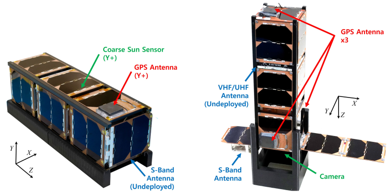

<strong>
Fig. SNUGLITE-II CubeSat: Before and after deployment
</strong>
 

The SNUGLITE-III CubeSat consists of two deployment systems that automatically deploy once angular velocity damping is completed. The overall system configuration and the components used are listed in the table below.

 

**Table. System Configuration of the SNUGLITE-II CubeSat**  
*DQPSK: differential quadrature phase-shift keying; GMSK: Gaussian minimum shift keying;*
*UHF: ultra-high frequency*
| System     | Description         |
|------------|---------------------|
| Mass       | 3.15 kg             | 
| Dimension  | 100x100x340 mm (3U, undeployed) |
|            | 100x414x340 mm (deployed)       |
| Orbit      | 700 km, SSO         |
| Uplink     | VHF (145.9 MHz), AX.25, GMSK 9.6 kbps (telecommand)  |
| Downink    | UHF (436.49 MHz), AX.25, GMSK 9.6 kbps (telemetry)   |
|            | S-Band (2405 MHz), DQPSK, 1 Mbps (mission data)      |
| Payloads   | SNU L1/L2C GPS Receiver x2 (2nd gen)                 |
|            | CubeSat GPS Attitude Determination Module            |
|            | Commercial Camera (Gopro Hero8)                      |
| Actuators  | Reaction wheel x3, Magnetorquer x3                   |
| Reference  | NORAD 52899, [SatNOGS](https://db.satnogs.org/satellite/YFNZ-9504-4902-9033-1722), [Gunter's Space](https://space.skyrocket.de/doc_sdat/snuglite-2.htm) |

 

**Table. Parts List of the SNUGLITE-II CubeSat**  
| Subsystem | Part Name               | Description             | Manufacturer    |
|-----------|-------------------------|-------------------------|-----------------|
| STR       | ISIS 3U Structure       | Primary Structure       | ISIS            |
| COM       | HISPICO Transmitter     | S-band TX               | IQ Spacecom     |
|           | HISPICO Antenna         | S-band Antenna          | IQ Spacecom     |
|           | ISIS Dipole Antenna     | UHF/VHF Antenna         | ISIS            |
|           | ISIS Comm Module        | Communication Module    | ISIS            |
| OBC       | Gomspace DMC-3          | Docking Board           | Gomspace        |
|           | Nanomind A3200          | Onboard Computer        | Gomspace        |
| EPS       | NanoPower P31u          | EPS Board               | Gomspace        |
|           | NanoPower BP4           | Battery Pack            | Gomspace        |
|           | P110 Solar Panel        | Solar Panel             | Gomspace        |
|           | Interstage GSSB         | Interstage Panels       | Gomspace        |
| ADCS      | Cubewheel Small         | Reaction Wheel          | Cubespace       |
|           | CubeTorquer Small       | Magnetic Torquer Rod    | Cubespace       |
| Payload   | Samyang 8mm F3.5        | Camera Lens             | Samyang Optics  |
|           | GPS Patch Antenna       | GPS Antenna             | Matterwaves     |
|           | GoPro Hero 7 Black      | Camera Module           | GoPro           |
|           | SNU GPS Receiver        | GPS Receiver x3         | In-house        |
|           | Camera Structure        | Camera Fixing Structure | In-house        |
|           | S-Band Antenna Structure| Deploy Structure        | In-house        |
|           | SNU Interface Board     | Storage, Connector, SPI | In-house        |

The overall electrical interface is illustrated in the following figure. The electrical interface is primarily divided into two OBCs, which serve as the basis for the Command and Data Handling (CDH) and Attitude Determination and Control System (ADCS) modules. The CDH manages communication and overall satellite operations, while the ADCS OBC integrates the attitude control and GPS attitude determination modules.

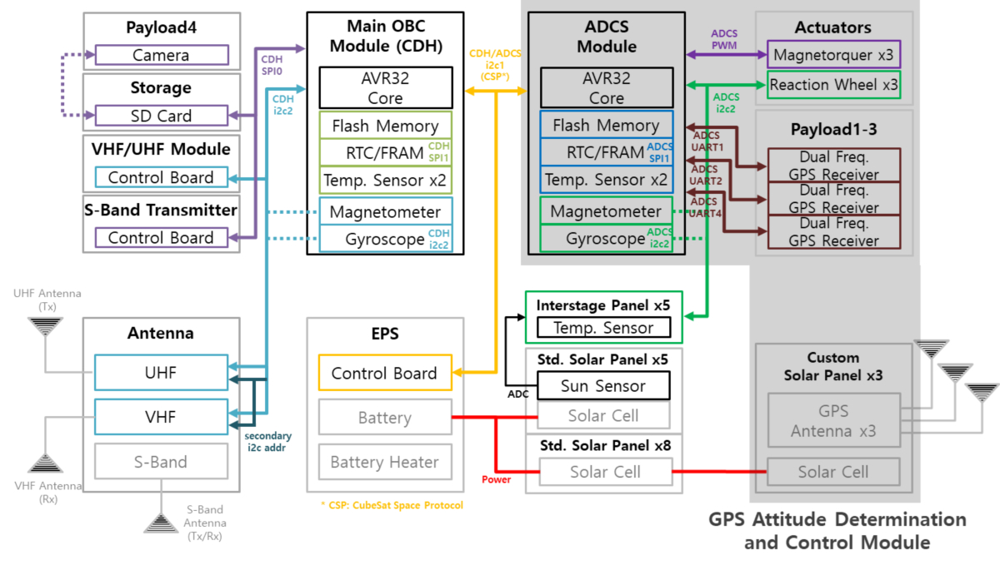

<!-------------------------------------------------------------------------------------->

### 1.3. Operation Scenario

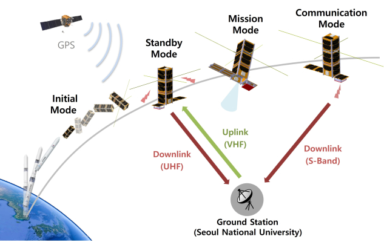

<strong>
Fig. Operation Scenario
</strong>
 

**1) Intial Mode (~5days)**
  - Flight software initialization
  - VHF/UHF antenna deployment (60 seconds after ejection)
  - Beacon transmission (every 20 seconds)
  - Detumbling control and convergence check
  - Solar panel deployment (automatic operation or ground station command after angular velocity converged)

**2) Standby mode (1 week ~ end of operation)**
  - Activate the GPS receiver
  - Beacon transmission (every 10 seconds)
  - Waiting for ground command
  - Satellite commissioning and condition check
  - Nadir pointing control

**3) Mission mode (1 month ~ end of operation)**
  - Collect GPS measurements
  - Collect camera image
  - Collect magnetometer, gyroscope, and sun sensor measurements
  - Nadir pointing control

**4) Communication mode (command  switching)**
  - Transmission of mission data (S-Band, UHF)
  - Ground station tracking control

**5) Safe mode (command switching)**
  - Beacon transmission (every 20 seconds)
  - Angular velocity decay control

The data collected during the operation of the SNUGLITE-II CubeSat was gathered during the initial mode to standby mode, focusing on the satellite's commissioning and status check. The data comprises records of satellite status occurrences collected through ground station commands in standby mode according to the system operation scenario, continuous beacon log data, and beacon data collected from the SNU ground station and overseas amateur ground stations (SatNOGS).

 
 

<!-------------------------------------------------------------------------------------->

## **2. Attitude Control System (ACS)**

The attitude control system was developed based on the experience from [SNUGLITE-I](/project/snuglite-i). In SNUGLITE-II, the addition of a reaction wheel required the design of a precise attitude controller, which I led throughout the entire process. The design of the overall attitude control system is illustrated in the following figure.

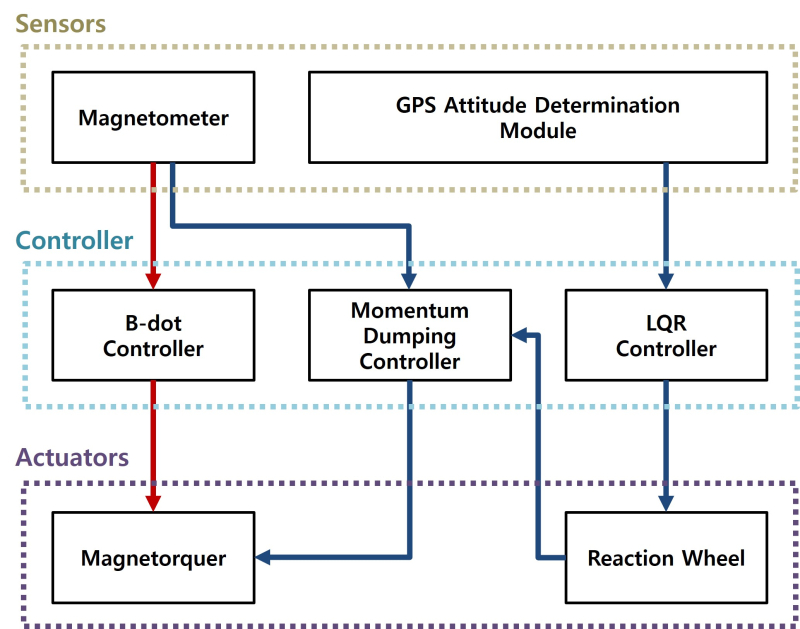

<strong>
Fig. Overall Block Diagram of ADCS
</strong>
 

The development concept for creating the ACS is as follows. As the objective was demonstration, thorough validation was essential, which was achieved by systematically performing the traditional SILS-PILS-HILS verification stages. The programs utilized during this phase included MATLAB, Visual Studio, and Linux Eclipse. Related papers can be referenced [here](/publication/dj_202301) (in Korean).

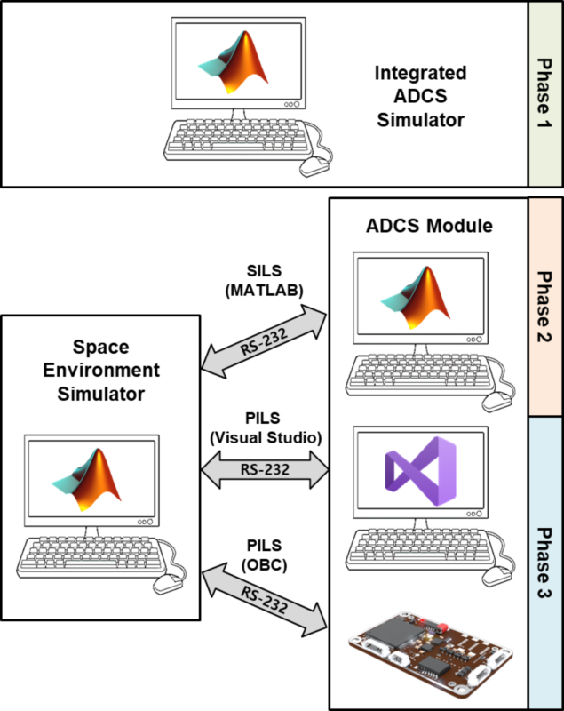

<strong>
Fig. Design Philosophy of ADCS
</strong>
 

### 2.1. Software-In-the-Loop Simulation (SILS)
 - SILS based on MATLAB 
 - Attitude control: LQR controller (quaternion-based, reaction wheel and magnetorquer)

**Video**:
    
 
 

<!-------------------------------------------------------------------------------------->

### 2.2. Hardware-In-the-Loop Simulation (HILS)

#### Single-axis attitude control system verificaton [(Not Published Yet: Limited Information)](/publication/ij_202502)
 - PILS: ADCS implamentation based on C (linux-gcc, FreeRTOS, Gomspace A3200 OBC)
 - Attitude determination: Extended Kalman filter (Sun+Magnetometer+Gyro)

**Video**: Reaction Wheel (In-house, EM), SNUGLITE-II (EM)
    

 
 

<!-------------------------------------------------------------------------------------->

## **3. Assembly, Integration, and Test (AIT)**

### 3.1. Hardware Design (PCB)

- All necessary interface boards for the satellite were designed and manufactured by **Hanjoon Shim**.

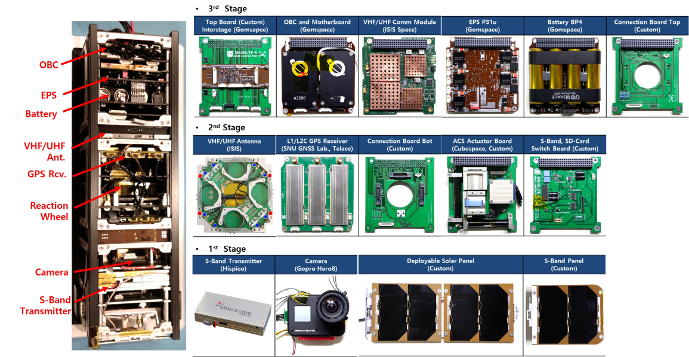

<strong>
Fig. Components of SNUGLITE-II
</strong>
 

 

<!-------------------------------------------------------------------------------------->

### 3.2. Assembly and Integration 
- Assembly: **Hanjoon Shim**, Hojoon Jeong
- Conducted all software tests associated with integration after assembly.

**Video**: SNUGLITE-II (FM) Assembly
    

 

<!-------------------------------------------------------------------------------------->

### 3.3. Environment Test

 - The Far-field test was conducted by hiking up Gwanak Mountain next to Seoul National University.

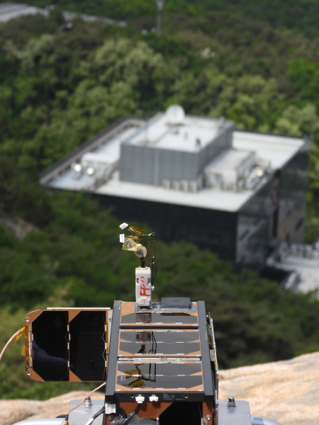

<strong>
Fig. Far-field Test
</strong>
 

 - Conducted vibration tests and thermal vacuum tests at the KTL Space Component Testing Center in Jinju.
 - The vibration test levels were less than 5g, indicating no significant structural issues.
 - The GPS receiver firmware required updates during the thermal vacuum test (cold failure).

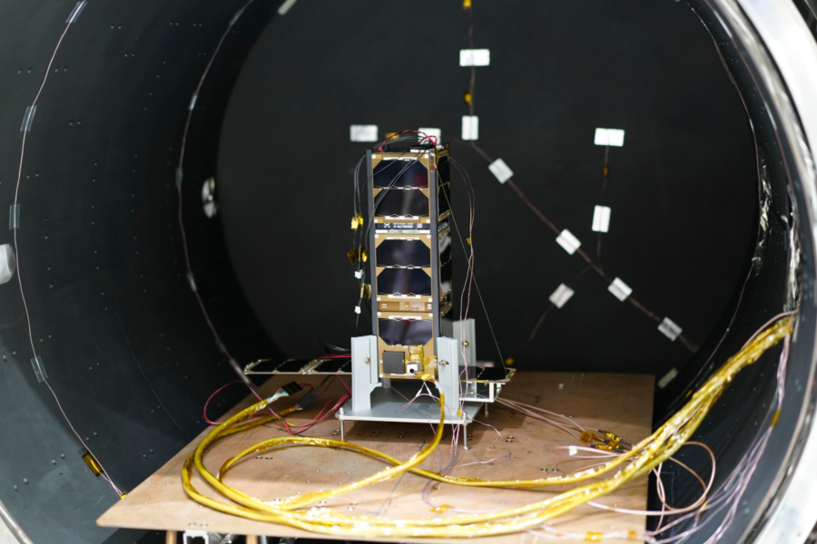

<strong>
Fig. SNUGLITE-II Thermal Vaccum Test
</strong>
 

**Video**: SNUGLITE-II (FM) EVT
    

 

<!-------------------------------------------------------------------------------------->

### 3.4. Mass Property Test
- Mass property testing and installation of the P-POD within the PVSAT (Performance Verification Satellite) were conducted at the Korea Aerospace Research Institute.

**Video**: Mass Property Test (in Korean)
    

 

<!-------------------------------------------------------------------------------------->

## **4. Operation Results**

### 4.1. Launch and Initial Operation

- On June 21, 2022, at approximately 16:00 (UTC+9), the SNUGLITE-II CubeSat was launched from the Naro Space Center in Goheung, South Korea, aboard the KSLV-II (Nuri) launch vehicle along with a performance verification satellite.
- On July 3, at approximately 16:23, the CubeSat was ejected from the P-POD of the performance verification satellite and successfully reached a sun-synchronous orbit at an altitude of 700 km.

**Video**: KSLV-II Nuri Launch at Naro-Space Center in Korea
    

 

**Video**: SNUGLITE-II CubeSat Ejection from PVSAT
    

 

- Immediately after ejection, an attempt was made to receive the beacon signal from the SNUGLITE-II CubeSat at the ground station located in Building 302 at Seoul National University; however, there was an issue with the deployment of the VHF/UHF antenna.
- The CubeSat responded to the antenna deployment command sent from the ground station, resulting in the successful deployment of the VHF/UHF antenna and normal reception of the beacon signal.
- The CubeSat was ejected with a slow initial angular velocity, and angular velocity stabilization was completed within 1 hour and 30 minutes.
- The GPS receiver operated successfully, and the system's time synchronization, as well as position and velocity information, was received and synchronized correctly.
- Subsequently, successful reception of state information recorded during three orbital cycles was achieved via low-speed UHF communication (9600 bps) through an average of four commands per day from the ground station.
- The recorded state information allowed for an analysis of the normal operation of the satellite's software and potential hardware defects.
- Communication was lost after 12 days of operation.

<!-------------------------------------------------------------------------------------->

### 4.2. CubeSat GPS L1/L2C Receiver

- Normal operation was confirmed through the position, time, and velocity information received from the GPS receiver in the satellite beacon.
- The GPS position measurement included in the data from SatNOGS, the SNU Ground Station, and satellite playback is shown below.

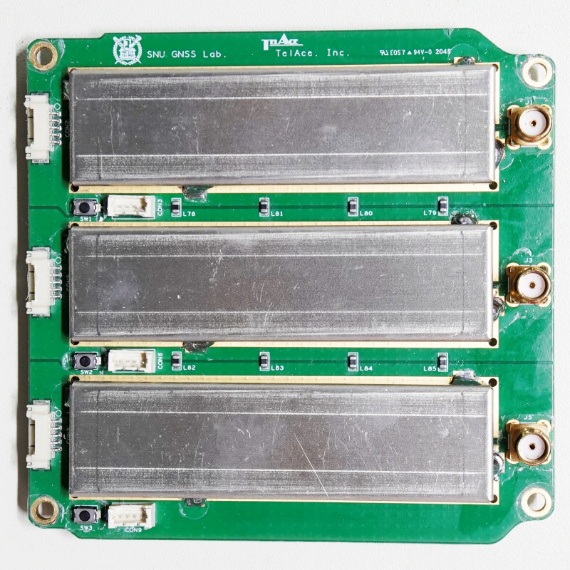

<strong>
Fig. SNUGLITE-II GPS Receiver Position 
</strong>
 

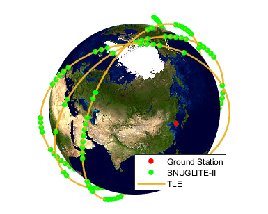

<strong>
Fig. SNUGLITE-II GPS Receiver Position vs TLE
</strong>
 

 

<!-------------------------------------------------------------------------------------->

### 4.3. ACS
- Successful angular velocity stabilization and maintenance of Earth-pointing attitude using the magnetorquer were achieved.
- The angular velocity recorded in the beacon is represented as a probability density distribution in the figure below.

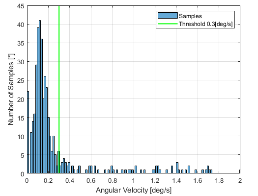

<strong>
Fig. SNUGLITE-II Angular Velocity in-Orbit
</strong>
 

 

 For more details, refer to the paper on in-orbit results (in Korean) [here](/publication/ij_202001/).

 

<!-------------------------------------------------------------------------------------->

 # For more information, refer to the related publications below. :)