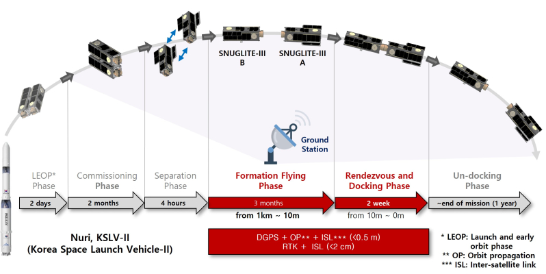

# ! Under Construction !

### Seoul National University GNSS Laboratory Satellite (SNUGLITE)-III Project (Ongoing)

The SNUGLITE-III CubeSat was selected as a finalist in the "2022 CubeSat Competition" organized by the Korea Aerospace Research Institute, receiving a total funding of 750 million KRW (~$600,000 USD). This mission involves two 3U CubeSats designed to perform autonomous rendezvous and docking without thrusters while conducting GPS radio occultation (RO) measurements, which will be used for 3D atmospheric observations of the Earth. As the successor to the [SNUGLITE-I](/project/snuglite-i/) and [SNUGLITE-II](/project/snuglite-ii/) missions, SNUGLITE-III is the final CubeSat project developed by Seoul National University's GNSS Laboratory. The mission focuses on advancing autonomous rendezvous and formation flying technologies, particularly developing a world-first thrusterless orbit control system and a GPS-only real-time kinematic (RTK) relative navigation system. SNUGLITE-III is scheduled for launch aboard Nuri (KSLV-II) during its 4th mission in November 2025 from the Naro Space Center.

This project is set to run from 2022 to 2026. The development team includes members from the SNUGLITE-II project, with me serving as a postdoctoral researcher, leveraging all the experiences gained during the SNUGLITE-II development. As part of this project, I provide guidance to the Ph.D. students while contributing to the development of the attitude control system, flight software, GPS relative navigation system, orbit control system, and assembly, integration, and test (AIT) processes.

이 프로젝트는 2022년부터 2026년까지 진행되는 것이 예정되어 있다. SNUGLITE-II 큐브위성 개발진이 대부분 참여하였으며, 나는 박사과정 학생으로 팀 리더에게 자문을 하면서 attitute control system, flight software, GPS relative navigation system, orbit control system, and assembly, integration, and test을 개발을 진행중이며 postdoctoral researcher으로써 SNUGLITE-II를 개발한 모든 경험을 기반으로 개발에 전념중이다. 

-	**GPS Relative Nagigation System (RN)**
     - 세계최초 저궤도 위성용 realtime kinematic (RTK) relative navigation system 개발
     - Conducted SILS (Matlab), PILS (Linux-gcc, C), and HILS
-	**Developed Attitute Control System (ACS) Algorithm**
     - Based on SNUGLITE-II ACS
     - Conducted SILS (Matlab), PILS (Linux-gcc, C), and HILS
-	**Developed Attitute Control System (ACS) Algorithm**
     - Based on SNUGLITE-II ACS
     - Conducted SILS (Matlab), PILS (Linux-gcc, C), and HILS
-	**Developed Flight Software**
     - Developed software based on a real-time OS (FreeRTOS, Gomspace A3200 OBC)
     - Round-robin-based scheduling (ADCS) program
     - Priority-based scheduling (CDH) program
- **Assembly, Integration, and Test (AIT)**
     - Hardware design (Solar panel, Interface board, Test bed)
     - Performed all stages of satellite assembly
     - Led the integration of subsystems and completed software integration (including sensor calibration)
     - Conducted far-field tests, vibration tests for launch, and space environment testing

   

<!-------------------------------------------------------------------------------------->

## **Index**

**[1. SNUGLITE-III CubeSat](#1-snuglite-iii-cubesat)** 
&nbsp;&nbsp;&nbsp;[1.1. SNUGLITE Team (2022)](#11-snuglite-team-2022)  
&nbsp;&nbsp;&nbsp;[1.2. System Configuration](#12-system-configuration)  
&nbsp;&nbsp;&nbsp;[1.3. Operation Scenario](#13-operation-scenario)  

 

<!-------------------------------------------------------------------------------------->

## **1. SNUGLITE-III CubeSat**

<!-------------------------------------------------------------------------------------->

### 1.1. SNUGLITE Team (2022)

**Table. SNUGLITE Team Member and Role (2022)**

1 RN: GPS Relative Navigation System, 
2 FSW: Flight Software,
3 ACS: Attitude Control System,
4 AIT: Assembly, Integration, and Test,
5 OCS: Orbit Control System,
6 PM: Project Manager, 
7 SYS: Satellite System,
8 ADS: Attitude Determination System,
9 EPS: Electrical Power System,
10 COM: Comuunication Sytstem,
11 GND: Ground Station,
12 STR: Structure System, 
13 THR: Thermal System,
14 PAY1: Payload1 (Docking Device),
15 PAY2: Payload2 (Inter-Satellite Link),
16 EOP: End of Project

| Name                                       | Role                                          | Participation Period |
|--------------------------------------------|-----------------------------------------------|-----------|
| [Changdon Kee](/author/changdon-kee/)      | Supervisor                                    | -         |
| [**Hanjoon Shim**](/author/hanjoon-shim/)  | **Technical Adviser (Former team leader, SNUGLITE-II)** | **~Now** |
|                                            | **1RN, 2FSW, 3ACS, 4AIT, 5OCS, 15PAY2** |  |
| [Yonghwan Bae](/author/yonghwan-bae)       | 6PM, 2FSW, 4AIT, 8ADS, 10COM, 11GND | ~EOP |
| [Hojoon Jeong](/author/hojoon-jeong)       | 5AIT, 9STR, 14PAY1 | ~EOP |
| [Jaeuk Park](/author/jaeuk-park)           | 9EPS, 10COM, 11GND | ~EOP |
| [Jae Woong Hwang](/author/jae-woong-hwang) | 5OCS, 11PAY1                  | ~EOP |
| [Seongjin Park](/author/jae-woong-hwang)   | 11PAY2                                   | ~EOP |
| [Jikang Lee](/author/jikang-lee)           | 10THR                                    | ~'24.3 |

 

<!-------------------------------------------------------------------------------------->

### 1.2. System Configuration

<strong>
Fig. SNUGLITE-III CubeSat: Before and after seperation
</strong>
 